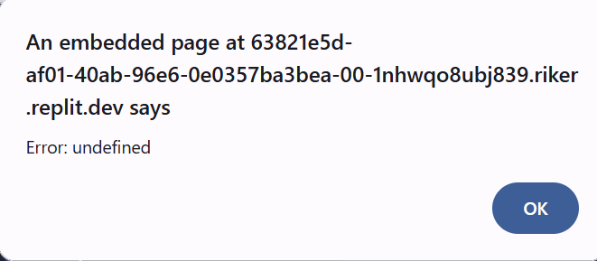
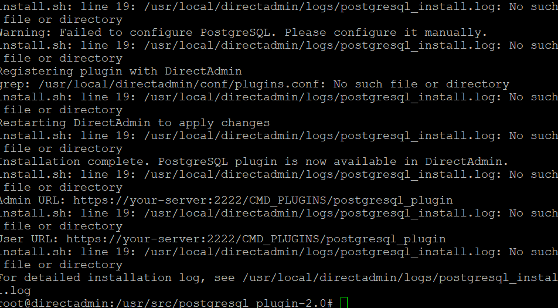
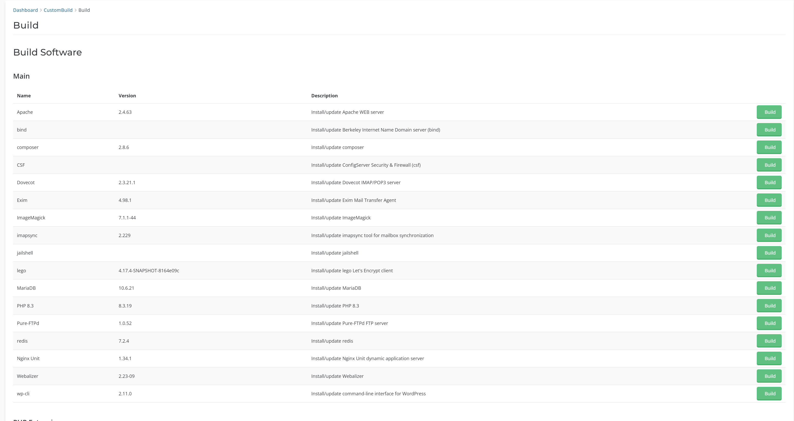

# PostgreSQL Plugin for DirectAdmin: Screenshots

This document provides screenshots and visual guides for the PostgreSQL Plugin for DirectAdmin.

## Table of Contents

1. [Admin Interface](#admin-interface)
   - [Dashboard](#admin-dashboard)
   - [Database Management](#admin-database-management)
   - [User Management](#admin-user-management)
   - [Server Configuration](#server-configuration)
   - [Logs and Monitoring](#logs-and-monitoring)
2. [User Interface](#user-interface)
   - [Dashboard](#user-dashboard)
   - [Database Management](#user-database-management)
   - [Connection Information](#connection-information)
3. [Installation](#installation)
   - [CustomBuild Installation](#custombuild-installation)
   - [Plugin Manager Installation](#plugin-manager-installation)
4. [Configuration Wizard](#configuration-wizard)

---

## Admin Interface

### Admin Dashboard

The admin dashboard provides an overview of your PostgreSQL server status, database statistics, and recent activity.

*Key elements:*
1. Server status indicator
2. Quick action buttons
3. Statistics overview
4. Recent activity log
5. Resource usage graphs

### Admin Database Management

Administrators can create, manage, and monitor all PostgreSQL databases on the server.

*Key features:*
1. Create new databases
2. Search and filter databases
3. View database details (size, owner, creation date)
4. Perform operations (backup, restore, delete)
5. Change ownership

### Admin User Management

The user management interface allows administrators to create and manage PostgreSQL database users.

*Key features:*
1. Create new users
2. Set/reset passwords
3. View and modify privileges
4. Associate with DirectAdmin users
5. Delete users

### Server Configuration

Administrators can tune PostgreSQL configuration parameters through this interface.

*Key features:*
1. General settings (connections, memory)
2. Performance settings
3. Security settings
4. Logging configuration
5. Apply changes and restart server

### Logs and Monitoring

View PostgreSQL server logs and monitor performance metrics.

*Key features:*
1. Live log viewer
2. Log filtering options
3. Performance metrics graphs
4. Activity monitoring
5. Export logs for troubleshooting

---

## User Interface

### User Dashboard

The user dashboard provides an overview of the user's PostgreSQL databases and quick actions.

*Key elements:*
1. Database summary
2. Quick action buttons
3. Recent activity
4. Usage statistics

### User Database Management

Users can create and manage their PostgreSQL databases.

*Key features:*
1. Create new databases
2. View database details
3. Import/export data
4. Delete databases

### Connection Information

Users can view connection details for accessing their databases.

*Key elements:*
1. Connection parameters (host, port)
2. User credentials
3. Connection string examples
4. Connection tips

---

## Installation

### CustomBuild Installation

The plugin appears in the DirectAdmin CustomBuild interface for easy installation.

*Key elements:*
1. PostgreSQL option in CustomBuild
2. Version selection
3. Installation options
4. Install button

### Plugin Manager Installation

The plugin can also be installed via the DirectAdmin Plugin Manager.

*Key elements:*
1. PostgreSQL plugin entry
2. Version information
3. Install/Update buttons
4. Plugin description

---

## Configuration Wizard

After installation, a configuration wizard guides the admin through initial setup.

*Key steps:*
1. Database location selection
2. Initial user setup
3. Security configuration
4. Integration options

---

**Note**: Some screenshots may vary slightly depending on your DirectAdmin theme and PostgreSQL version.

*Last updated: March 22, 2025*